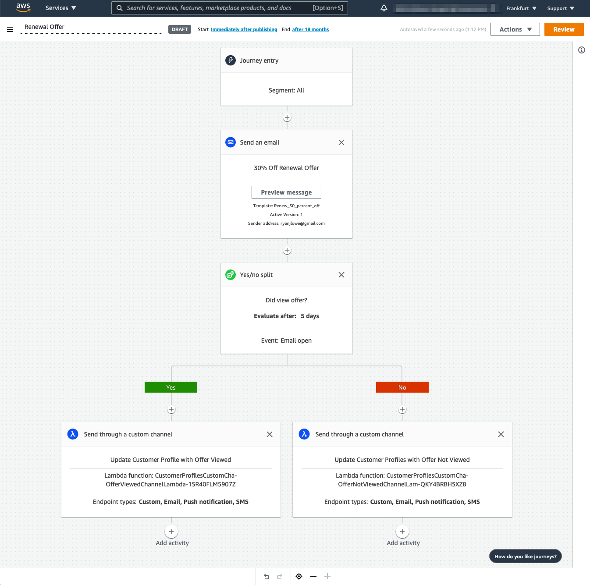

# Amazon Pinpoint Custom Channel for Amazon Connect Profiles

[Amazon Connect's Customer Profiles](https://aws.amazon.com/connect/customer-profiles/) allow customers to deliver more personalized customer experiences with less effort through a unified view of all customer data presented to the agent at the moment of contact. Amazon Connect Customer Profiles combines customer data from disparate data sources such as Salesforce, Service Now, and home-grown applications with contact history in Amazon Connect to create unified customer profiles.

Amazon Pinpoint has three channels available natively out of the box that work with campaigns and journeys: Email, SMS, and Push for Mobile Devices.  Additionally, customers can create their own [custom channels](https://docs.aws.amazon.com/pinpoint/latest/developerguide/channels-custom.html) allowing marketers to send messages across any "channel" using any service that can be reached by an AWS Lambda function.  

This repository shows an example of an Amazon Pinpoint Custom Channel that is configured to write data back to a customer profile.  In this specific example, we are writing back to the customer profile whether or not an customer viewed an email that contained an offer.  We can use Amazon Pinpoint's journey feature to send all of our customers an offer, example: 30% off a purchase.  Using the built-in Yes/No splits for engagement decisions, we can easily determine which customers viewed the offer email and which ones did not.  We can then place our custom channel on either side of an engagement split to update our customer profiles.  This would allow an agent access to see what offers a customer has received and knowledge of if they have seen the offer or not - all while on call with them.  This could help in renewal / churn scenarios where the agent could notify the customer that they do in fact have an offer available if they want to renew!

## Prerequisites

Before we can deploy the CloudFormation template containing our custom channels, we need to prepare Amazon Connect Customer Profiles.

### Deploy Python SDK in Lambda Layers

As of writing this repository, the [AWS Lambda version of the AWS Python SDK is at boto3-1.15.16](https://docs.aws.amazon.com/lambda/latest/dg/lambda-python.html).  The code in this repository uses the customer-profiles service which was introduced to the AWS Python SDK at version [1.16.28](https://github.com/boto/boto3/blob/develop/CHANGELOG.rst#11628).  In order to use this code, we must manually deploy the AWS Python SDK, version 1.16.28 or later, as an [AWS Lambda layer](https://docs.aws.amazon.com/lambda/latest/dg/configuration-layers.html).

```
$ mkdir -p boto3-layer/python
$ pip install boto3 -t boto3-layer/python
$ cd boto3-layer
$ zip -r aws-boto-layer.zip python
$ aws lambda publish-layer-version --layer-name boto3-layer --description boto3-latest-version --zip-file fileb://path/to/boto3-layer/aws-boto-layer.zip
```

Note the `LayerVersionArn` from the `aws lambda...` response.  This will be needed for the CloudFormation Template.

### Ensure Customer Profiles is enabled

Follow the Amazon Connect Admin Guide to [Enable Customer Profiles](https://docs.aws.amazon.com/connect/latest/adminguide/customer-profiles.html) for your Amazon Connect instance.  Ensure that you create, and note the name of, a Customer profiles domain.

## Deploy the CloudFormation Template

The [template](template.yaml) in this repository will deploy two different AWS Lambda functions with the necessary IAM permissions.  One Lambda function is for customers who viewed the offer, and the other is for customers who did not view the offer.  Both write data to Customer Profiles using the [PutProfileObject API](https://docs.aws.amazon.com/goto/WebAPI/customer-profiles-2020-08-15/PutProfileObject).  A third Lambda function is deployed and ran once to register the new profile object type using the [PutProfileObjectType API](https://docs.aws.amazon.com/goto/WebAPI/customer-profiles-2020-08-15/PutProfileObjectType).

## Create an Amazon Pinpoint Journey

Now you can go into Amazon Pinpoint and create a journey like the one shown below.  Add a Yes/No split after an email extending the offer to users.  The Yes/No split will hold for 5 days before checking to see if they opened the email or not using Amazon Pinpoint's default tracking capabilities.  After which, the users who did not open the email will be passed down the No path and vice versa.  The Customer Profiles will be updated for each user with the appropriate attributes.


